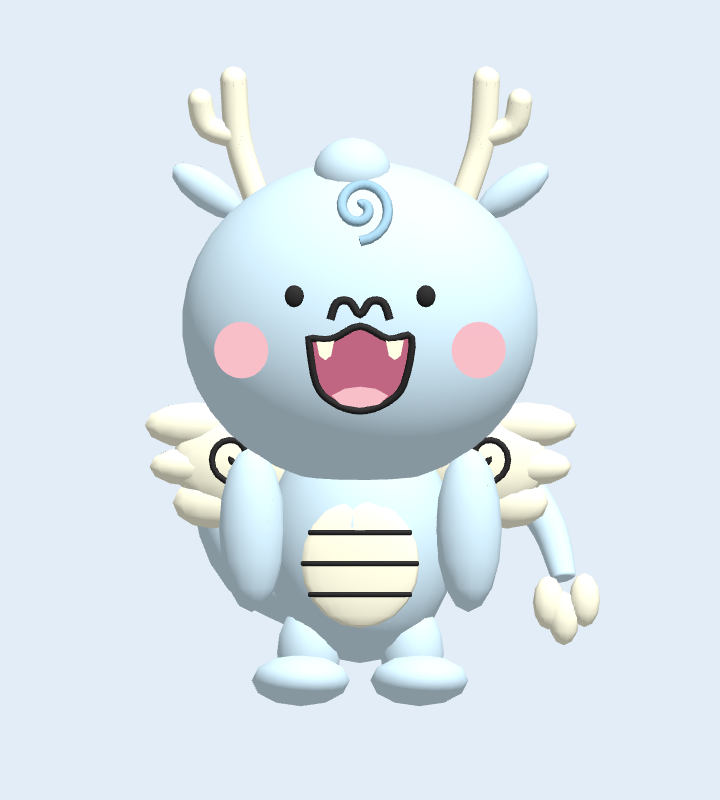
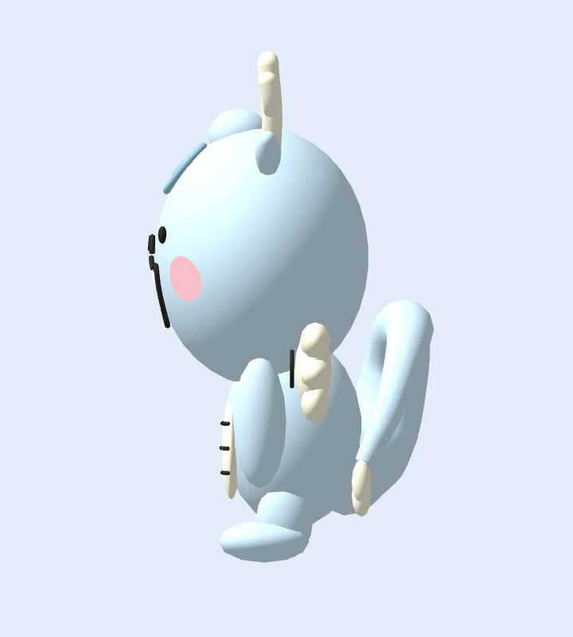
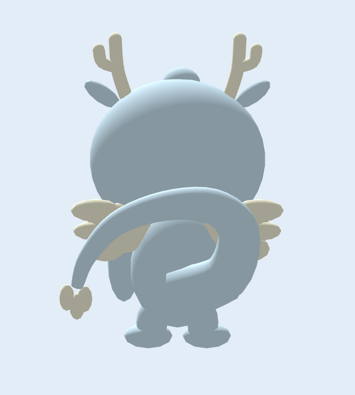
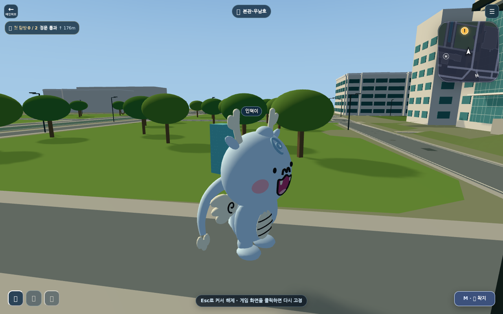

# ANNYONGI-3D-REDESIGN-01

Status: implementation and local acceptance completed; **design review and deployment acceptance pending**. Do not interpret passing tests as university design approval. No merge, Production deployment or external email was performed.

Baseline main was queried directly at work start: `c6916d17e4d57ec05ab08af26ce0633e8c2824d5`. A final remote query found two new main commits; this branch was cleanly rebased onto **`03b89364b32c064cab26db7e2e7d70b38fc5eb59`** before PR creation. The upstream changes fix main-gate initialization and fifth-building clock placement, without changing this asset or mount contract. Full World/static and campus desktop/mobile checks were rerun after rebase. Branch: `feat/annyongi-3d-redesign-01`.

## Visual review

These are actual PlayCanvas renders of the committed GLB. The campus image uses the real local campus entry point, with the browser harness's offline API stubs. No reference photograph or generated illustration is substituted for model evidence.

| Front | Side |
| --- | --- |
|  |  |
| Back | INHA WORLD ride, daylight |
|  |  |

[Mobile ride screenshot](images/mobile-ride-three-quarter.png). Full ascent, movement, first-person and landing captures are generated under `test-results/annyongi/` and uploaded by character-model CI.

The cyan box behind the mascot is the **existing public-repository Induck QA rider**, not an added saddle or part of Annyongi. Other brand assets remain outside this redesign. Production's upstream Induck geometry must be checked separately against the new seat. Campus lighting darkens the base palette; the studio views use neutral lighting.

## Design and authorship

See [discovery and source details](DISCOVERY.md). The university's basic/front/right/back/left PNGs are the primary authority, with official goods as secondary examples. The repo's placeholder PNG was not used as a design reference.

Preserved: large round head and compact body, pale blue `#D3EDFB`, cream forked horns, small ears, forehead curl, dot eyes, pink `#F6BEC8` cheeks, m-shaped nose, smiling mouth with two fangs, cream belly and bands, short limbs, small cloud wings, curled tail and pale lobed tip. Official cream is `#FFFDE4`. No giant flight wings, long muzzle, scales, armor or saddle were added.

The old asset was 12 QA cuboid meshes / 144 triangles with a teal material and `Public_QA_Carrier` root. It did not express these identifying features. The replacement is newly authored procedural geometry, reproducible with Python's standard library. The original artwork is used as a visual reference only, without embedded image pixels or textures. Depth, surface curvature and facial relief are reconstruction judgments and remain subject to design review.

| Asset property | Result |
| --- | --- |
| Triangles | 9,940 |
| Mesh parts / materials / textures | 26 / 1 / 0 |
| PBR | metallic 0, roughness 0.9, linear vertex colors |
| Canonical / optimized bytes | 287,292 / 242,612 (15.552% reduction) |
| Canonical SHA-256 | `e00f7065fb4176277e2e3fdf2e7487d50686be983fffcdbced0ae379a6c8d8aa` |
| Optimized SHA-256 | `1cd7e98c5814b883a9b73a3903c252ab78df72776e25d3884ccab6d7a3d8a86f` |

`ASSET_PROVENANCE.json` and `NOTICE.md` describe official-design reconstruction, project authorship, source family, no textures and a pending design review. Permission is recorded as the user's reported noncommercial-use correspondence, not independently verified correspondence or approval of this model. No official game operation or sponsorship is claimed.

## Runtime and delivery

- `Annyongi_Root` contains named body/face/limb/tail/cloud-wing parts. `DragonWing_L/R` remain empty, stationary compatibility nodes. Decorative cloud wings never flap.
- `RiderAnchor` at `[0, 0.16, -0.64]` seats the rider behind the head. Carrier pitch transforms the seat consistently. Existing assets without an anchor keep their old offset. Equipment and labels follow the same position path for local and remote characters.
- Airborne hover is ±0.045 world units; moving flight uses a bounded 4-degree pitch. Grounded poses do not hover. Movement, entitlement, mount identifiers and multiplayer messages are unchanged.
- Annyongi gets a camera profile with initial distance 5, min 3.5, max 12 and a shorter look-ahead. Visual QA found the old generic flight framing could put this compact model outside the screen. Other flight mounts keep their previous profile; first-person still hides the local character.
- The two Annyongi Vercel proxy routes are removed. Runtime source and optimized paths now resolve to source-controlled/build-generated static files. Replacing only the GLB would otherwise leave Production using the old Supabase upstream.
- Build runs strict optimization and asset validation. Other brand assets keep their existing API/Supabase routes. The legacy explicit `/api/brand-asset?asset=annyongi-flight-v1.glb` endpoint is unchanged; current runtime paths do not call it. The Supabase optimized function was inspected for compatibility but was not changed or deployed.
- Existing load-failure fallback remains. A failed load can still show the legacy emergency carrier; the canonical successful load uses the new mascot.

## Verification

| Check | Result |
| --- | --- |
| Full World tests, `node --test apps/world/tests/*.test.mjs` | 3,530 passed, zero failures/skips |
| `node apps/world/qa.mjs` | PASS |
| `node apps/world/assets/check_characters.mjs` | PASS; structure, normals, budget and provenance hash |
| Python generator reproduced committed GLB | Byte-identical |
| `npm test --prefix tools/world-assets` | 6/6; exact position/normal/color/index and semantic-node preservation |
| `node tools/world-assets/optimize-world-assets.mjs --strict` | 6 optimized, zero fallback |
| `sh apps/world/build-recast-shadow.sh` | PASS, including generated static optimized asset |
| Khronos glTF Validator: source and optimized | 0 errors, 0 warnings |
| Real PlayCanvas character runtime tests | 8/8 |
| Existing character loading browser smoke | PASS, 12 snapshots |
| New studio capture | Four views; optimized front pixel-identical to source |
| New campus desktop/mobile acceptance | Both PASS, no observed fatal console/page errors |
| Additional edge tests | 35/35 |

Browser evidence uses WebGL2 / Chromium 153 in this environment. Standard Playwright Chromium download failed with truncated archives; an external local executable was supplied through optional `WORLD_SMOKE_EXECUTABLE`. CI continues to install its pinned Playwright Chromium normally. A Korean system font was installed locally for readable review captures. No production code font override was introduced.

Desktop: 1280×800, keyboard ascent and forward flight. Mobile: 390×844, touch-capable emulation, actual touch events on the ascent button and joystick. Both exercise mount, hover, framing, head/rider separation, first-person hiding, landing and dismount. Clipping uses actual rider vertices in the carrier's head ellipsoid space (minimum normalized squared distance about 1.413, outside 1). This is targeted QA for the current rider and not a proof for every possible avatar geometry.

Receipts: [studio](result.json), [campus](campus-results.json), [GLB](glb-validation.json).

```sh
python3 tools/world-assets/build-annyongi.py
git diff --exit-code -- apps/world/assets/annyongi-flight-v1.glb
node apps/world/assets/check_characters.mjs
npm ci --prefix tools/world-assets --ignore-scripts
npm test --prefix tools/world-assets
node tools/world-assets/optimize-world-assets.mjs --strict
node --test apps/world/tests/*.test.mjs
node apps/world/qa.mjs
npm ci --prefix apps/world/tests/browser --ignore-scripts
node --test apps/world/tests/browser/character-model-loading-runtime.test.mjs
npx --prefix apps/world/tests/browser playwright install chromium
WORLD_SMOKE_DISABLE_WEBGPU=1 node apps/world/tests/browser/character-model-loading-smoke.mjs
WORLD_SMOKE_DISABLE_WEBGPU=1 node apps/world/tests/browser/annyongi-capture.mjs
WORLD_SMOKE_DISABLE_WEBGPU=1 node apps/world/tests/browser/annyongi-campus-smoke.mjs
```

## Remaining acceptance and merge position

Keep the PR in draft pending the user's design review and separate merge authorization. The two-page Korean review PDF supplied with the task presents Front / Side / Back / in-game ride and summarizes intended design preservation and game-only motion. It has not been emailed.

Not yet verified: candidate deployment on Production, physical iPad/Safari/GPU performance, Production's upstream rider/equipment geometry, and a live two-client multiplayer session. Shared character, first-person, equipment and multiplayer contracts pass automated tests, but that does not substitute for these live checks. No preview deployment was created merely to bypass the user's Production preference.

Visual judgment: the key official face, palette, compact proportions, horns, cloud wings and tail are recognizable in the inspected renders; this is the implementer's assessment, not independent university sign-off. Final design acceptance remains a human review separate from test PASS. This task is therefore not claimed as fully DONE under all requested completion gates.
