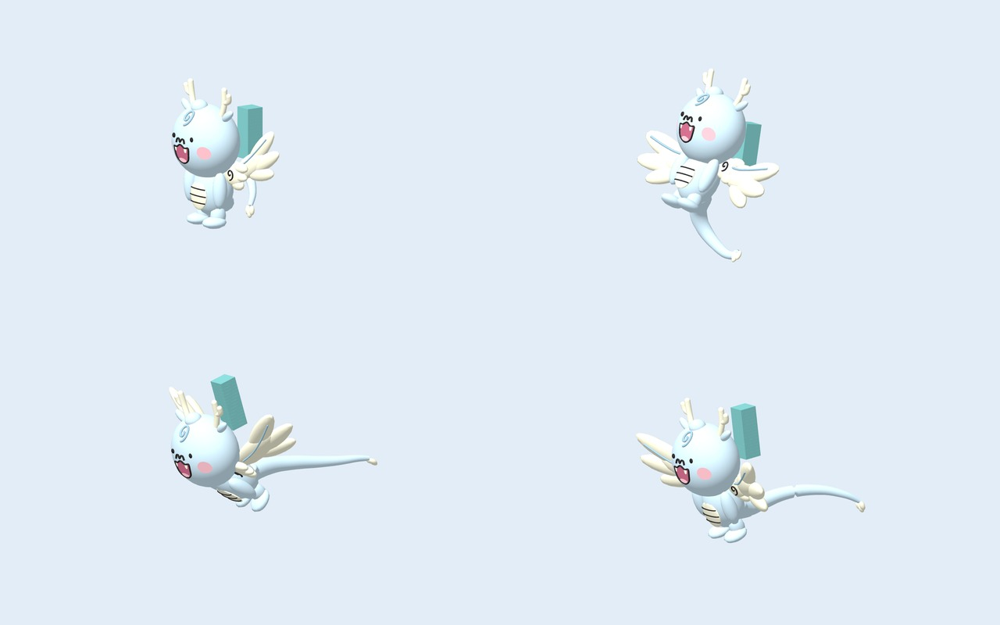
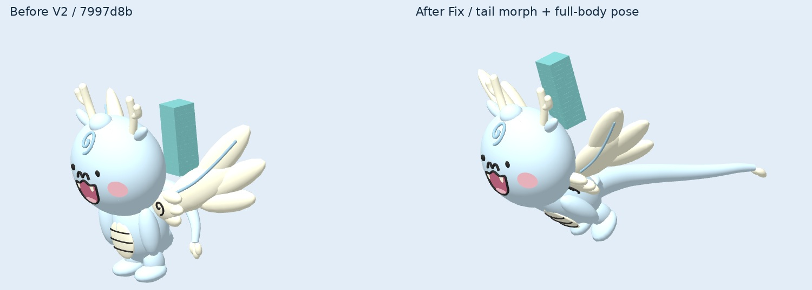
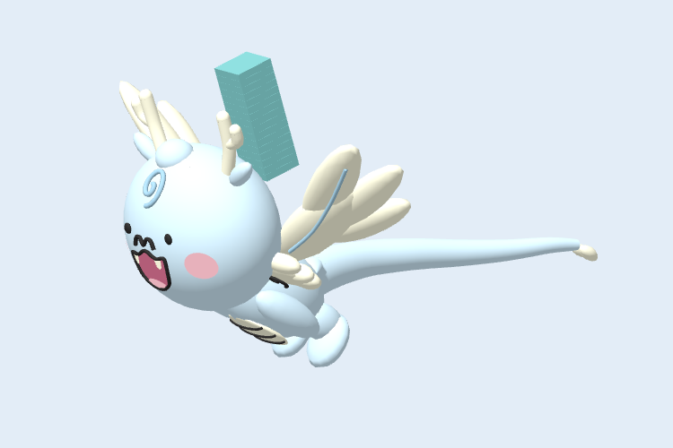
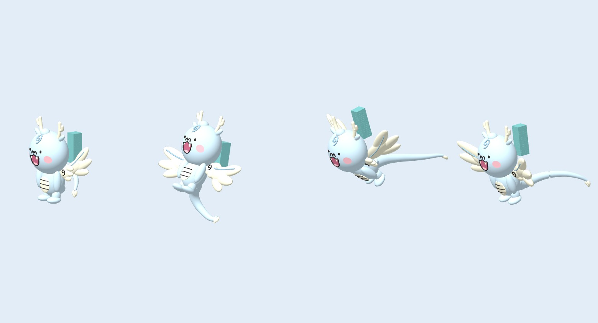
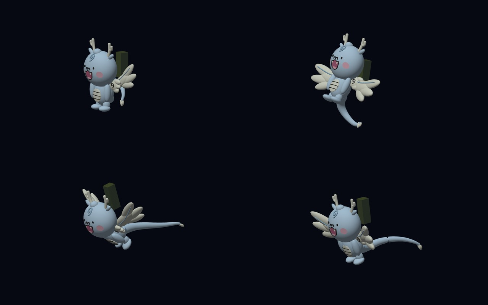
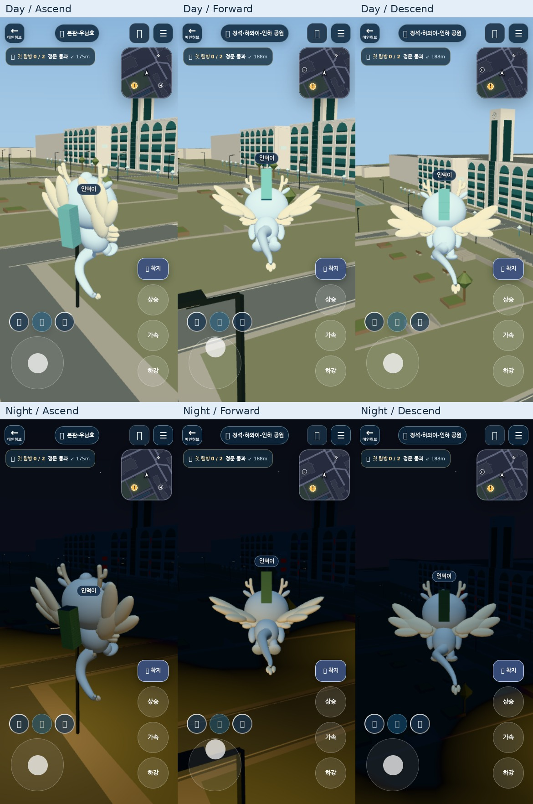
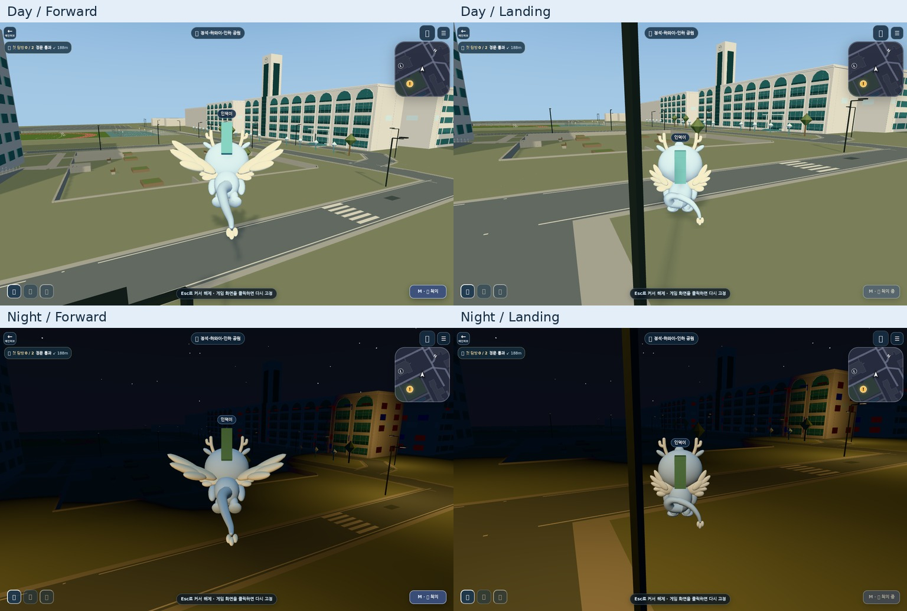
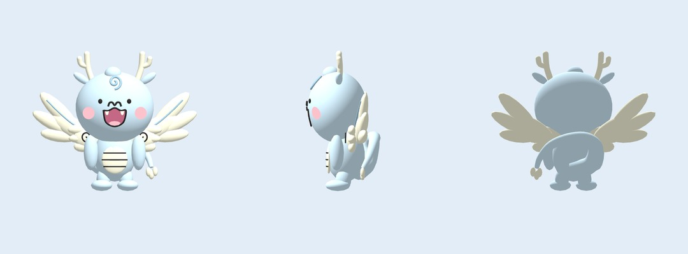

# ANNYONGI-FLIGHT-V2-FIX — Tail deformation / full-body flight

PR [#286](https://github.com/aldol2678/inhagame/pull/286)의 후속 수정. Draft 유지, main 병합·Production 배포 없음.

작업 시작 시 GitHub PR API와 `git ls-remote`를 직접 조회했다.

- 최신 main: `c4fe1bcb30183c793cb4829f04e2b65590f92253`
- 시작 PR head / Before V2: `7997d8b81ec665c6da373e30d1d628c0fadbe0a1`
- 이전 [V2 검토](../annyongi-flight-v2/README.md)는 당시 결과를 기록한 역사적 자료다. 아래 이미지가 이번 수정 결과다.

## 실제 형태 변경

기존 꼬리의 topology와 mesh 이름 `Tail`, `TailCloud`를 유지하고, 두 mesh 모두 `TailAscend`, `TailForward`, `TailGlide`라는 glTF morph target을 추가했다. 각 target에는 POSITION과 NORMAL delta가 있다. 몸 전체 회전으로 꼬리 변형을 대신하지 않는다. 전진 때 cloud tip은 carrier 기준 뒤쪽 Z < -3까지 실제로 이동한다. Hover/Ground에서는 target weight가 0으로 돌아가 기존 말린 꼬리가 복원된다. 뿌리 ring은 고정해서 몸통 접점을 유지한다.

| 상태 | 몸/머리 | 꼬리 | 날개 |
|---|---|---|---|
| Hover | 직립, 작은 bob | 원래 말린 형태 | 70% deployment, 느린 stroke |
| Ascend | 몸 -32°, 머리 +12° 보정, 상승 lift | 아래/뒤로 부분 전개 | 최대 전개, 48° amplitude / 11 rad/s |
| Forward | 몸 +58°, 머리 -46° 보정 → 얼굴 실제 +12° | 길게 후방 전개 | 후퇴각 38°, 추진형 stroke |
| Descend | 몸 +24°, 머리 -20° 보정 | 후방/하방 곡선 | 넓은 활공, amplitude 3° / 2 rad/s |
| Landing | 지면까지 5m 안에서 직립 복귀 | 남은 고도에 따라 다시 말림 | deployment/bob 감소, 접힘 |

몸·머리·꼬리·날개는 공통 exponential smoothing(6/s)을 사용한다. 날개 phase는 계속 이어지고 frequency도 blend한다. Ground 진입에서 pitch를 0으로 직접 대입하던 snap을 제거했다. `FlightHeadPivot` 아래에 얼굴·뿔·귀·표정 전체를 모아 고개 보정 중 이목구비가 분리되지 않는다.

라이더는 torso가 아닌 RiderAnchor의 발 접점을 중심으로 기울어진다. anchor Z는 -.74에서 -.80으로 조정했다. 자세 전환 중 실제 라이더 vertices와 움직이는 머리 공간의 교차 검사도 유지한다. 기본 Annyongi camera 거리는 6.2→7.4, 기존 portrait 1.35배 보정과 줌 기억/1인칭 계약은 유지한다.

V2의 확장 구름날개, private light mask/fill, 재질 색 보정, 공식 얼굴·배·뿔, mount/physics/network schema는 유지한다. main에서 현재 지면까지의 거리를 시각 계층으로 전달하는 한 줄만 추가했다.

## 시각 검토

동일 카메라 / 동일 simulated duration의 실제 PlayCanvas WebGL2 렌더. AI 생성 이미지가 아니다. 기본 공개 레포의 인덕이 라이더는 청록 QA cuboid이므로 Production 인덕이의 최종 외형을 보여주는 자료는 아니다.



위 왼쪽부터 Hover / Ascend, 아래 Forward / Descend. 텍스트 없이도 직립·상승·긴 전진·활공 실루엣을 비교할 수 있다.



동일한 1280×800 카메라와 입력 조건. Before는 시작 head의 모델/런타임을 별도 worktree에서 그대로 사용했다. 재사용한 파일은 캡처 harness뿐이다.





각 원본 viewport는 390×844. 상태 순서는 Hover / Ascend / Forward / Descend.





실제 캠퍼스의 터치 상승 / 전진 / 하강. 위는 주간, 아래는 야간. 터치·키보드 입력, 착륙, 탑승/하차, 1인칭 진입/복귀까지 실행한다.





## 계약 / 재현

- generator: `INHAGAME Annyongi procedural flight reconstruction v2.1`
- 12,188 triangles / 28 meshes / 1 vertex-color material / 0 textures. V2와 동일한 triangle/draw mesh 수.
- Source 394,672 bytes, SHA256 `5b53dd9a13e2123bab399f68483c3fa72259b75888edf67b9bab32553a53fc23`.
- runtime URL은 `annyongi-flight-v1.glb` 그대로 유지한다.
- `DragonWing_L/R`, `RiderAnchor`, 기존 mesh 이름 유지. `FlightHeadPivot`과 두 tail mesh의 3개 morph target은 명시적 새 계약이다.
- optimizer test가 hierarchy, target names/weights, POSITION/NORMAL delta와 기존 vertex palette/index를 모두 byte array 수준에서 비교한다.
- canonical/optimized 네 포즈의 픽셀 동일성 및 Khronos error/warning 0을 Character model browser CI에 추가했다.

```sh
python3 tools/world-assets/build-annyongi.py
node apps/world/assets/check_characters.mjs
npm ci --prefix tools/world-assets --ignore-scripts
npm test --prefix tools/world-assets
node tools/world-assets/optimize-world-assets.mjs --strict
node tools/world-assets/validate-annyongi.mjs
node --test apps/world/tests/*.test.mjs
node apps/world/qa.mjs
node --test apps/world/tests/browser/character-model-loading-runtime.test.mjs
WORLD_SMOKE_DISABLE_WEBGPU=1 node apps/world/tests/browser/character-model-loading-smoke.mjs
WORLD_SMOKE_DISABLE_WEBGPU=1 node apps/world/tests/browser/annyongi-capture.mjs
WORLD_SMOKE_DISABLE_WEBGPU=1 node apps/world/tests/browser/annyongi-flight-pose-capture.mjs
WORLD_SMOKE_DISABLE_WEBGPU=1 node apps/world/tests/browser/annyongi-campus-smoke.mjs
```

## CI 실패 원인과 수정

직접 읽은 실패 로그: [run 37601290414 / job 112726020212](https://github.com/aldol2678/inhagame/actions/runs/37601290414/job/112726020212).

asset 재생성, optimizer, 실제 GLB lifecycle, 기존 12-snapshot character smoke는 모두 통과했다. 실패는 `annyongi-campus-smoke.mjs:28`의 `page.screenshot: Timeout 30000ms exceeded`. 로그에는 fonts loaded까지 기록되어 있고 모델 assertion 실패는 없었다.

캠퍼스 캡처를 completed frame 경계에서 pause하고, framebuffer를 복사한 후 `finally`에서 다시 시작하도록 고쳤다. software renderer가 캠퍼스를 계속 그리며 screenshot과 경쟁하지 않도록 하는 조치다. 이때 projected bounds도 동일한 멈춘 frame에서 수집하고, morph delta까지 반영한다. 캡처 timeout은 60초로 명시했다. 테스트 삭제, CI skip, assertion 완화는 하지 않았다. 프레이밍 assertion은 오히려 Hover 외에 상승/전진/하강까지 확대했다. rider 검증은 새 발 중심 회전 계약에 맞춰 중심 높이 대신 실제 발 좌표를 검사한다.

## 한계

- Chromium software WebGL2에서 desktop/mobile viewport를 검사했다. 실제 iOS Safari·Android GPU의 FPS/발열은 측정하지 않았다.
- 라이더는 공개 QA cuboid. 실제 Production 인덕이 에셋 조합은 별도 확인 필요.
- 기존 FLY network payload에 grounded/ground clearance가 없어 remote avatar는 transform 기반 상승/전진/하강을 표시하고, local landing과 같은 지면 접근 blend를 재현하지 않는다. protocol은 변경하지 않았다.
- 가독성은 개선했지만 공식 캐릭터 신규 게임용 변형에 대한 대학 측 디자인 승인을 주장하지 않는다.
- Production 배포/실사용자 계정/온라인 다중 접속 검증은 수행하지 않았다.

테스트 수치와 캡처 상태는 [QA.md](QA.md), `campus-results.json`, `pose-results.json`, `glb-validation.json`에 기록한다.
