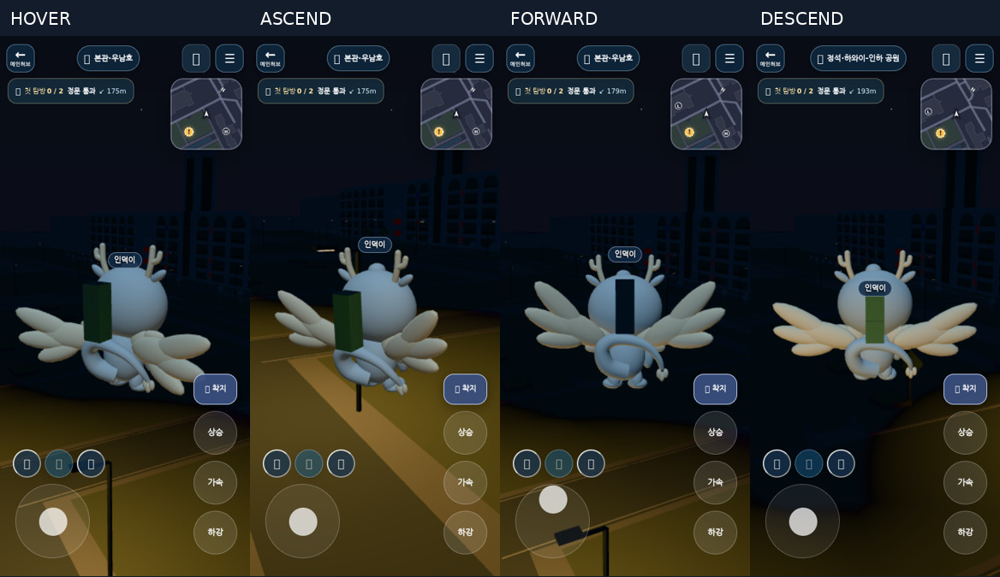

# V2 validation receipts — 2026-10-07

## Executed checks

| Check | Result |
| --- | --- |
| `node --test apps/world/tests/*.test.mjs` | **3,625 PASS**, zero failures/skips |
| `node apps/world/qa.mjs` | **PASS** |
| `node --test apps/world/tests/browser/character-model-loading-runtime.test.mjs` | **10/10 PASS**: actual GLB parsing, independent loading/failure/disposal, shared containers, equipment/canary, anchor, four flight poses, teleport rejection, wing deployment, head clearance, private light masks/material ownership and cleanup |
| `npm test --prefix tools/world-assets` | **6/6 PASS**, including exact geometry, semantic hierarchy and anchor preservation |
| Strict optimizer | **6 optimized**, zero fallback; Annyongi 17.556% smaller |
| Deterministic regeneration | **Byte-identical SHA-256** |
| Khronos glTF Validator: source and optimized | **0 errors / 0 warnings / 0 infos** |
| `sh apps/world/build-recast-shadow.sh` | **PASS**, including strict optimization and asset/provenance check |
| Existing WebGL2 character loading smoke | **PASS, 12 snapshots**; partial failures, visibility, first person, disposal, late callbacks, canary rollback |
| Studio source vs optimized | **Pixel-identical front**; front/side/back/day/night captured |
| Real campus desktop 1280×800, day and night | **PASS** |
| Real campus mobile portrait 390×844, day and night | **PASS** |
| Fatal console / page errors in successful browser runs | **None observed** |

The previous smoke asserted an invariant rider/carrier **origin** offset. That invariant no longer holds during smooth carrier tilt; it now asserts rider attachment to the transformed **RiderAnchor**. Fallback carriers still use their old origin. This preserves the actual attachment contract instead of accepting arbitrary drift.

## Input and visual assertions

Campus cases use keyboard Space/W/C on desktop and actual CDP touch input on ascent/joystick/descent controls on mobile. They test mount, ascent, hover, forward flight, descent, close orbit, first person, automatic landing and dismount. First person hides local carrier/rider. Whole-mascot projected vertices are inside the viewport at default hover and three-quarter views. Tests assert the runtime flight state during each input; synthetic teleports are restricted to test setup/altitude preparation.

The current public QA rider clears the authored head ellipsoid during hover, ascent, full forward tilt and descent. These checks are not a proof for Production's different avatar/equipment geometry.



Night screenshots show a readable pale-blue body, pink cheeks, dark face marks and cream wings, with shape shading retained. This is an implementer visual assessment, not independent user/university approval. Tail remains visible but no longer occupies the main flight silhouette. Side view is naturally narrower than front/back; the swept rounded lobes separate from the compact curl.

## Reproduction

```sh
npm ci --prefix tools/world-assets --ignore-scripts
npm ci --prefix apps/world/tests/browser --ignore-scripts
python3 tools/world-assets/build-annyongi.py
node apps/world/assets/check_characters.mjs
npm test --prefix tools/world-assets
node tools/world-assets/optimize-world-assets.mjs --strict
node --test apps/world/tests/*.test.mjs
node apps/world/qa.mjs
node --test apps/world/tests/browser/character-model-loading-runtime.test.mjs
sh apps/world/build-recast-shadow.sh
npx --prefix apps/world/tests/browser playwright install chromium
WORLD_SMOKE_DISABLE_WEBGPU=1 node apps/world/tests/browser/character-model-loading-smoke.mjs
WORLD_SMOKE_DISABLE_WEBGPU=1 node apps/world/tests/browser/annyongi-capture.mjs
WORLD_SMOKE_DISABLE_WEBGPU=1 node apps/world/tests/browser/annyongi-campus-smoke.mjs
```

Local Playwright browser archives were truncated. A separately installed Chromium 153 executable with SwiftShader was used via `WORLD_SMOKE_EXECUTABLE`; the repository's pinned Playwright and PlayCanvas remain unchanged. CI keeps its normal browser installation. Korean font support was installed for local review only; some emoji glyphs remain unavailable. No browser test contacted online account services.

GitHub CI is separate from these local results. See the PR checks for the exact remote head status. Physical devices, hardware WebGPU, Production avatar geometry and live two-client multiplayer remain unverified.
