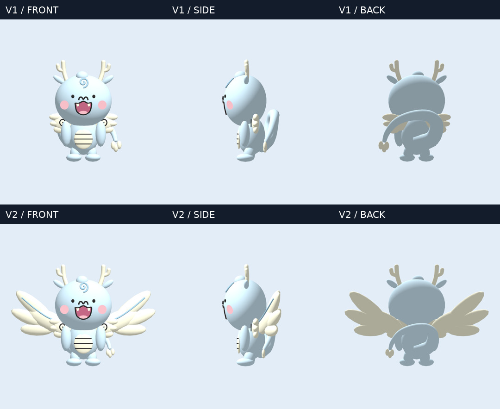
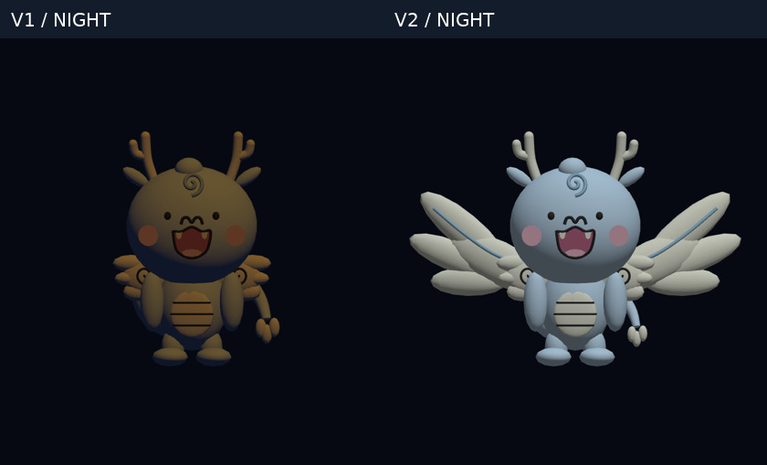
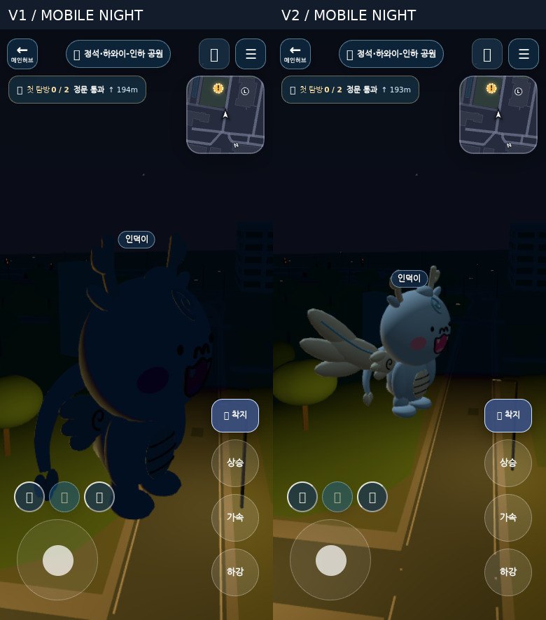
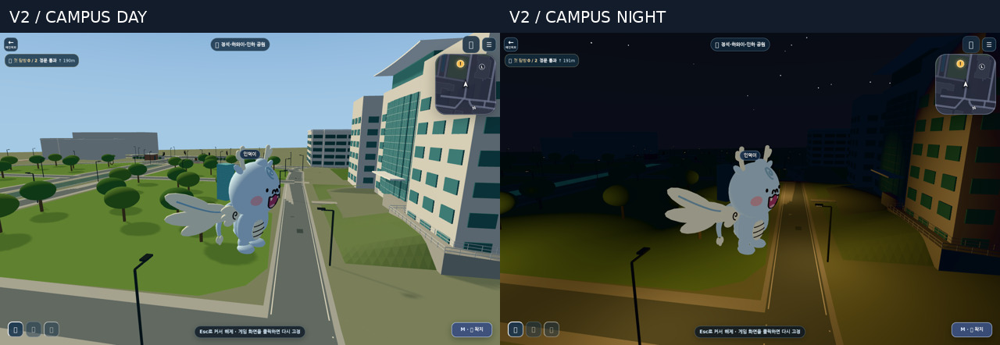

# ANNYONGI-FLIGHT-V2 — 비행형 안뇽이

**Status: implementation complete; user visual acceptance and merge authorization pending.**
No main merge or Production deployment is performed by this work. This is a game-specific flight adaptation, not a newly approved university mascot design.

## Baseline and review inputs

- Queried public `aldol2678/inhagame` main at work start and again before submission: `c4fe1bcb30183c793cb4829f04e2b65590f92253`.
- GitHub PR #283 is merged; its merge commit is the baseline above. Its generator, GLB, runtime integration, provenance, README and DISCOVERY are present in this checkout.
- Read the two-page `ANNYONGI-3D-REVIEW.pdf` and visually inspected the user's three night/mobile screenshots (`1000012958.jpg`, `1000012959.jpg`, `1000012960.jpg`). User screenshots are reference inputs, not republished public artifacts.
- The V1 PDF's fixed, small decorative wing rule is superseded **for game flight** by the user's V2 brief. The official face/proportion/color/reference observations remain valid. No new university design approval is inferred.

## Visual evidence

All evidence below is actual PlayCanvas/Chromium rendering. No generated illustration is used as model evidence. Studio comparisons use the same camera, lighting and scale; campus comparisons deliberately include the changed shipping camera profile. Campus uses the real `/campus/` entry point with the existing offline API stubs, not Production/account data.

Individual final views: [front](images/front.png), [side](images/side.png), [back](images/back.png), [night front](images/night-front.png), [mobile day](images/mobile-day.png), [mobile night](images/mobile-night.png).

The rectangular rider is the **existing public-repository Induck QA asset**. It is not an added saddle. Production's different Induck geometry/equipment still requires separate acceptance.

## Design changes and limits

| Area | V2 behavior |
| --- | --- |
| Identity | Original head, face, cheeks, fangs, curl, forked horns, short limbs, belly and small cloud-wing meshes preserved. Palette unchanged. |
| Flight wings | Two new broad, overlapping rounded cream fans, approximately 3.8 units across at full deployment. Small official cloud wings remain fixed at the roots. No sharp membranes, armor or saddle. |
| Ground/flight | Fans fold to 24% scale on ground and ease open in flight. Existing `DragonWing_L/R` names now parent `FlightWing_L/R`; `RiderAnchor` remains a meshless semantic node. |
| Hover | ±15° slow wing stroke, existing small vertical bob. |
| Ascend | Up to ±32° faster wing stroke, bounded -9° carrier pitch. |
| Forward | Wings sweep back 27°, stroke narrows to ±12°, carrier leans forward up to 13°. |
| Descend/landing | Broad braking pose, -12° sweep and ±4° stroke, -5° pitch; pitch/bob reset on ground, wings fold. |
| Transitions | Continuous wing phase and eased amplitude/sweep/deployment prevent phase jumps when changing flight state. Visual state derives from existing movement; teleport spikes are ignored. |
| Tail | Curled silhouette and cream lobed tip preserved; lateral/vertical size ×0.82, depth ×0.9, lowered 0.20 units. Wings now dominate the flight outline. |
| Seat | Anchor lowered and moved back: `[0, .16, -.64]` → `[0, -.08, -.74]`. Rider leans with 45% of carrier pitch; equipment and labels retain the common position path. |
| Camera | Annyongi only: initial 6.2, min 4.5, max 16; lead .2, height .3. Portrait adds at most ×1.35 distance, preserving user zoom memory. Walking, other mounts, collisions and first-person behavior retained. |
| Night | Two shared, unshadowed, cool fill lights affect **only** Annyongi mesh mask bit 256. Day intensity is zero. Private material clones use a small vertex-color emission floor .045–.070; diffuse is reduced at night to limit warm-lamp contamination. Ink stays dark. No bloom or scene-light/exposure edit. |

The fill is reference-counted per application (two lights total, not per avatar), released with its last instance, and never modifies the shared container material. The reserved light bit is currently unused by other repository content. Future mesh/light mask changes must preserve that exclusivity.

Remote characters derive ascent/descent from received positions and forward pose from existing horizontal velocity. The existing `FLY` wire state does **not** encode ground versus hover. Therefore a remote mounted Annyongi keeps wings deployed until dismount; no protocol/schema change is introduced. Live two-client synchronization remains unverified.

## Asset pipeline

| Property | Result |
| --- | --- |
| Triangles | 12,188 (V1: 9,940; +2,248) |
| Meshes / materials / textures | 28 / 1 / 0 |
| Source / optimized bytes | 348,468 / 287,292 |
| Canonical SHA-256 | `0fb517db8bfb01984b0d8e039a722858f1aa4189ddd688e7d25c65d819d30ee7` |
| Optimized SHA-256 | `b1a9c396cd9baa9cf8badc75e711d98161e12561c34c77e21964650f86f50121` |
| Generator | `INHAGAME Annyongi procedural flight reconstruction v2` |

The runtime URL remains `annyongi-flight-v1.glb` for compatibility; generator/provenance and these documents distinguish V2. Python standard-library regeneration is deterministic. Optimized output remains build-derived/ignored. The validator budget is explicitly raised to 13,000 triangles / 450 KB for the two new wings; no global budget is loosened.

Optimization verifies names, parent/child hierarchy, translations and exact positions/normals/colors/indices. Source and optimized front screenshots are pixel-identical. `ASSET_PROVENANCE.json` and `NOTICE.md` record the game adaptation honestly.

## Validation

See [QA receipts](QA.md), [campus observations](campus-results.json), [studio receipt](studio-results.json), and [Khronos validation](glb-validation.json).

## Remaining acceptance

- User design approval is pending. Larger wings are intentionally a game adaptation, not a claim that the university supplied this flight form.
- Physical Android/iOS/iPad Safari, hardware WebGPU/performance and live multiplayer are not tested here. Chromium uses software WebGL2.
- Public repository rider is a QA carrier; Production's actual Induck/equipment may need additional anchor tuning. Current rider/head separation passes hover, ascent, forward and descent checks.
- Camera checks cover desktop 1280×800 and portrait 390×844, including default full-body framing, near zoom and first person. Extremely close manual orbit or collision-compressed angles may crop wings; this does not change collision authority.
- Night fill deliberately favors readable identity. It adds two unshadowed directional lights with a private mask; device-specific performance still requires measurement.
- No Production or Preview deployment is performed. Remote CI and the final PR status must be checked independently of local PASS.

후속 전신 비행 포즈/꼬리 변형 수정: [ANNYONGI-FLIGHT-V2-FIX](../annyongi-flight-v2-fix/README.md).
