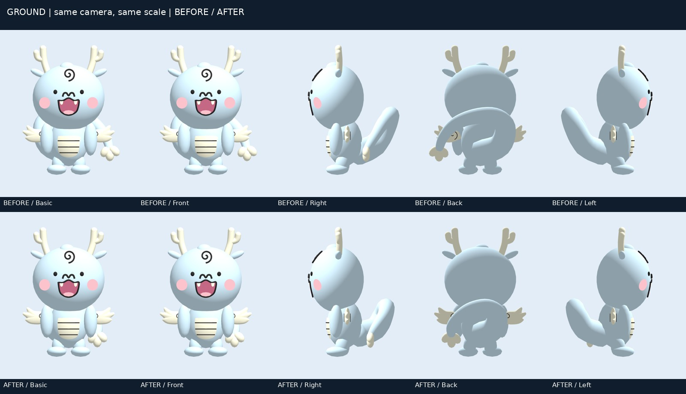
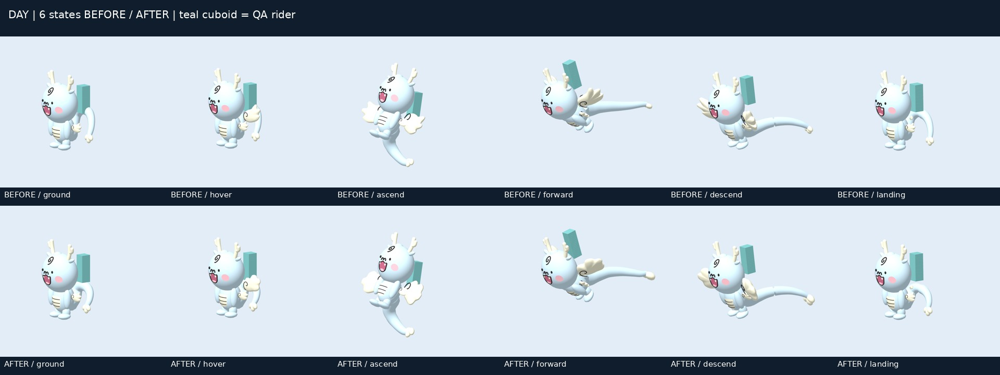
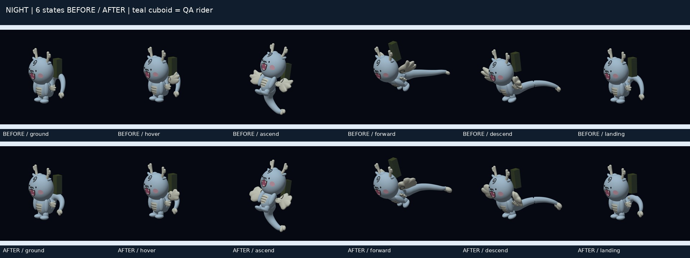
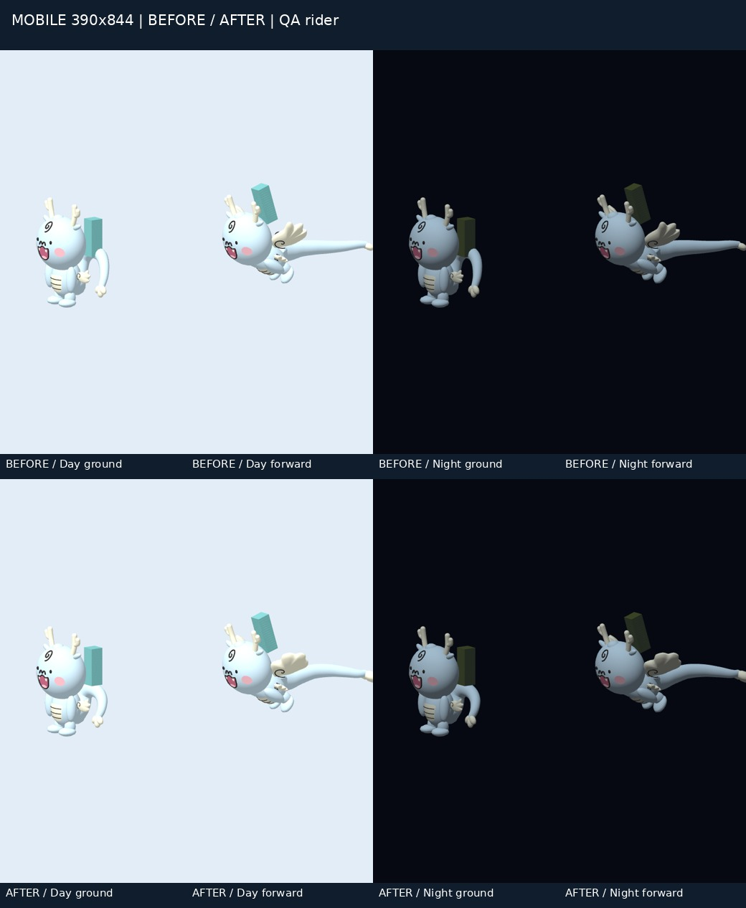

# MASCOT-3D-FIDELITY-01-R1

PR #305, existing `work/mascot-3d-fidelity-01` branch. Baseline: `80da3eac51102ab019cd005a5a689f9698a9cf95`. Draft review candidate, not university design approval. No merge or Production deployment.

## Minimal patch

- P0-A: gather the standing tail curl nearer the rump; preserve the exact attachment ring and cap, indices, vertex counts, colors, three POSITION/NORMAL targets and zero default weights.
- P0-B: replace narrow protrusions of the extended wing with broad rounded scallops. Small CloudWing_L/R geometry, internal spirals, DragonWing pivots and runtime animation are unchanged.
- P0-C: retain the Forward endpoint and long extension, add a gentle middle curve, enlarge airborne cream tip lobes (Forward 1.5×; Ascend 1.15×; Glide 1.35×).
- Files: generator, generated Annyongi GLB, provenance hash/version and validator generator version. No runtime, camera, equipment, physics, server or Biryong code changes in R1.

## Verification

Completed results were preserved across session interruptions; no full render/test repeat was used merely to recover the session.

| Check | Result |
|---|---|
| World unit/integration | 3,793/3,793 PASS |
| Real PlayCanvas GLB runtime | 12/12 PASS |
| Optimizer tests / strict optimization | 6/6 PASS; no fallback |
| Static World QA | PASS |
| Khronos source + optimized | 0 errors / 0 warnings |
| Deterministic GLB regeneration | byte-identical |
| Baseline/candidate animation snapshots | 24/24 exact equal |
| Source/optimized pixels | 4 flight states exact equal |
| Actual rider/head separation | 7 transitions × 120 steps PASS; minimum 1.1976562551, threshold 1 |
| Offline campus, actual rider | Desktop 1280×800 / mobile 390×844, day/night 4/4 PASS, 40 captures |
| Hierarchy, indices, vertex counts/colors | exact equal to baseline |
| Tail attachment ring/cap, small CloudWing | exact equal to baseline |

Source GLB: 404,620 bytes; 12,558 triangles, 28 meshes, one material, no textures. Both existing budgets (450,000 bytes / 13,000 triangles) pass. SHA-256: `5128e60ee75c53cf36b062f7a5d275f005bd5a563416467b3fe7c4501692aceb`.

Evidence: [geometry](geometry-contract.json), [pose parity](pose-parity.json), [GLB validation](glb-validation.json), [optimized parity](optimized-parity.json), [campus](campus-results.json), [rider separation](production-rider-results.json), [test logs](test-log-summary.json).

## Fresh paired PlayCanvas captures

Each BEFORE was freshly rendered from `80da3ea`; AFTER uses this R1 GLB. Same camera, light, time input and viewport. Teal cuboid = public QA rider, not Production Induck. Existing screenshots were not relabeled as new results. No AI-generated images.

## Remaining visual acceptance and limits

The standing curl is more compact, but its tubular 3D cross-section still differs from the manual's broad, graphic rear-view curl. Expanded wings remain a game adaptation; a perfectly edge-on view cannot preserve a full cloud outline. The larger cream tip reads more clearly, but its three lobes can overlap in a distant or foreshortened mobile view. These are user visual-review items, not proof of official approval.

The supplied official manual page 4 was inspected locally; it explicitly prioritizes recognizable 2D design over strict perspective. Basic/front captures share the same front camera. The six flight-state comparison uses the existing oblique camera, not an exhaustive angle sweep. No new exhaustive front/side/back airborne sweep was added during minimal completion.

Local renderer is Chromium 153 / SwiftShader WebGL2, with mobile viewport/touch emulation. Physical Android/iOS, hardware WebGPU and multiplayer are unverified. Rider/head checks are vertex-versus-head-ellipsoid tests; no exhaustive triangle-level tail/equipment collision proof is claimed. Existing motion and camera acceptance passed. Production Induck original/captures and school source documents are excluded from this public folder.

Initial local launch failed because `/tmp/chromium` did not exist; the existing Chromium executable was selected. The semantic validator initially rejected the new generator version; only its exact version string was updated. Subsequent checks passed without budget relaxation. Conversation interruptions occurred after background checks completed; their precise platform cause is unknown.

Remote CI is separate from these local results. Read the final PR/head status; never infer CI success from local PASS.

See [separate read-only Biryong investigation](BIRYONG-CI.md).
